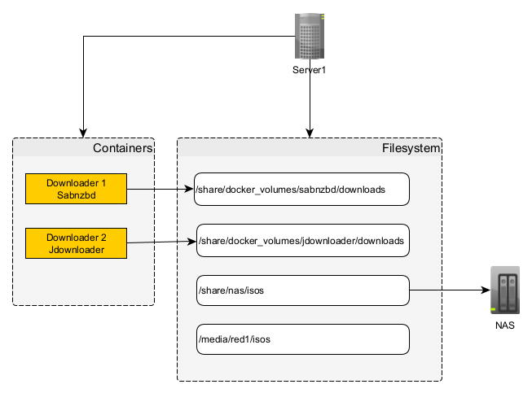
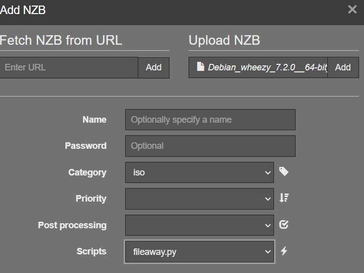
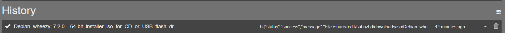

## File Away Flow
File Away Flow is an API that allows you to move files between folders, it is helpful for postprocessing files,
downloaded in containers like Sabnzbd, nzbget or Jdownloader.

Consider the following scenario:


If we want to move files after they are downloaded from (`/share/docker_volumes/sabnzbd/downloads`) to (`/share/nas/isos`), 
we can use a postprocess script, but it will execute in the container (Sabnzbd) and not in the host machine,
so we will need to mount the (`/share/nas/isos`)  as part of the container which will require to create a new 
mountpoint inside the container and modify the Dockerfile. or we can use this API that runs on the host machine, and the postprocess script
simply calls this API to do the moving.

## Api Service
The api only has 2 endpoints:

- `/health` to check if the service is healthy
```bash
> curl http://localhost:8002/api/health
{
  "status": "success",
  "message": "FileAwayFlow API is up and running"
}
````
- `/api/files/move` endpoint to move files
```bash
> curl --request POST \
  --url http://localhost:8002/api/files/move \
  --header 'Content-Type: application/json' \
  --header 'X-API-KEY: 123456' \
  --data '{  
  "sourcePath" : "/share/docker_volumes/sabnzbd/downloads/iso/Debian_wheezy_7.2.0__64-bit_installer_iso_for_CD_or_USB_flash_dr",  
  "targetPath": "/share/nas/iso/Debian_wheezy_7.2.0__64-bit_installer_iso_for_CD_or_USB_flash_dr"  
}'
{
  "status": "success",
  "message": "File /share/docker_volumes/sabnzbd/downloads/iso/Debian_wheezy_7.2.0__64-bit_installer_iso_for_CD_or_USB_flash_dr moved successfully"
}
```

## Installation

This project consists of two parts, the API and the postprocess script. 

to build the API you need to install rust and cargo (https://www.rust-lang.org/tools/install).
```bash
cargo build --color=always --profile release --package FileAwayFlow --bin FileAwayFlow
  Finished `release` profile [optimized] target(s) in 2.02s
```

The binary should be in the `target/release` directory, copy the binary file to `/usr/local/bin/fileawayflow`
the api can be run by any user, just make sure the user has the proper permissions to manipulate the files.

Alternatively if you don't want to build it I've provided a binary for linux-x64 as a release asset https://github.com/ivaano/FileAwayFlow/releases.
Tested only on debian 12, but it should work fine on any x64 linux distro.


### Create a system service to start the API on boot:
Location:
```bash
> sudoedit /etc/systemd/system/fileaway.service
```
Contents:
```ini
[Unit]
Description=API to move files around.
After=syslog.target network.target

[Service]
User=ivan
Group=ivan
UMask=0002
Type=simple
Environment="API_KEY=secret"
ExecStart=/usr/local/bin/fileawayflow 8002
TimeoutStopSec=10
KillMode=process
Restart=on-failure


[Install]
WantedBy=multi-user.target
```

To start the service on boot using systemctl:
```bash
> sudo systemctl daemon-reload
> sudo systemctl enable fileaway.service
> sudo systemctl start fileaway 
```
To check service status:
```bash
> sudo systemctl status fileaway
● fileaway.service - API to move files around
     Loaded: loaded (/etc/systemd/system/fileaway.service; enabled; preset: enabled)
     Active: active (running) since Wed 2024-10-23 15:06:11 PDT; 2s ago
   Main PID: 647632 (fileawayflow)
      Tasks: 7 (limit: 9357)
     Memory: 1.1M
        CPU: 4ms
     CGroup: /system.slice/fileaway.service
             └─647632 /usr/local/bin/fileawayflow 8002

Oct 23 15:06:11 zenyata systemd[1]: Started fileaway.service - API to move files around.
Oct 23 15:06:11 zenyata fileawayflow[647632]: 🚀 Server started successfully, listening on port 8002
```

## Environment Variables
`API_KEY` is the API key that will be used for authentication, if is not set, it will default to `123456`

## Program Arguments
The server only takes 1 argument which is the port number. The default port is `8000` in our service example
are passing the `8002` argument to start the server on port `8002`.

The second part involves the postprocessing script that will run once the download is complete, there is a 
sample script for sabnzbd, the script is really simple, it uses urllib to avoid adding any dependencies
and it takes sabnzbd arguments, checks if the ir a match in the categories we can process, and then makes
the call to the api to do the actual move.

## Screenshots


