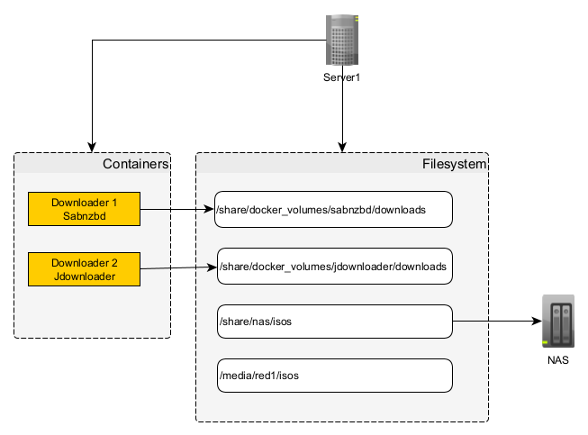
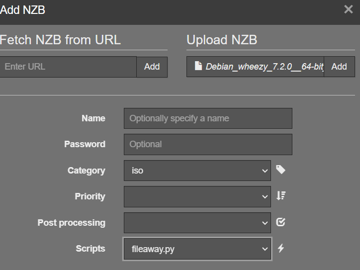
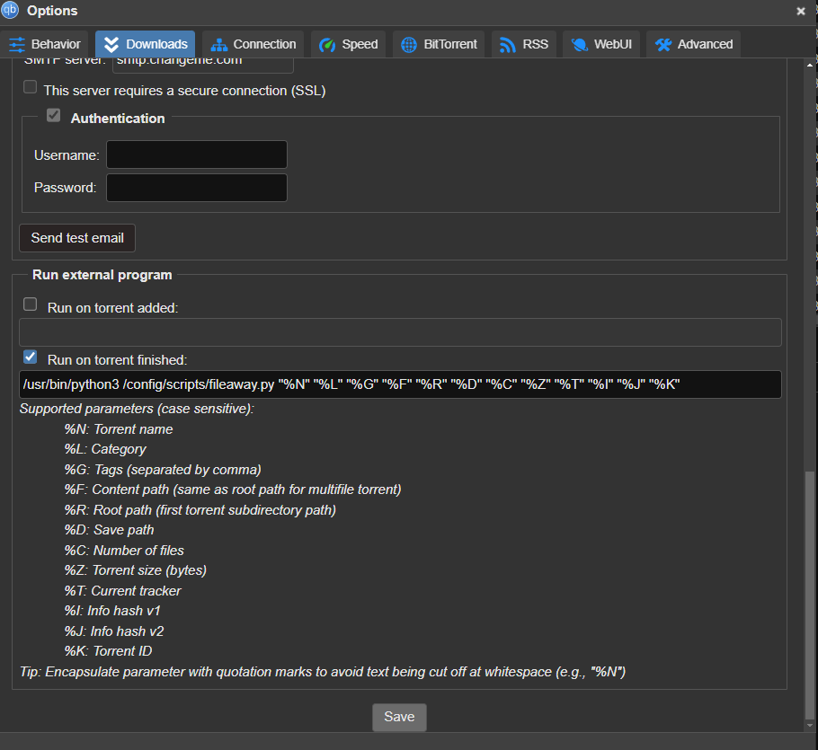

## File Away Flow
File Away Flow is an API that allows you to move files between folders, it is helpful for postprocessing files,
downloaded in containers like Sabnzbd, nzbget or Jdownloader.

Consider the following scenario:


If we want to move files after they are downloaded from (`/share/docker_volumes/sabnzbd/downloads`) to (`/share/nas/isos`), 
we can use a postprocess script, but it will execute in the container (Sabnzbd) and not in the host machine,
so we will need to mount the (`/share/nas/isos`)  as part of the container which will require to create a new 
mountpoint inside the container and modify the Dockerfile. or we can use this API that runs on the host machine, and the postprocess script
simply calls this API to do the moving.

## Api Service
The api only has 3 endpoints:

- `/health` to check if the service is healthy
```bash
> curl http://localhost:8002/api/health
{
  "status": "success",
  "message": "FileAwayFlow API is up and running"
}
````
- `/api/files/move` endpoint to move files
```bash
> curl --request POST \
  --url http://localhost:8002/api/files/move \
  --header 'Content-Type: application/json' \
  --header 'X-API-KEY: 123456' \
  --data '{  
  "sourcePath" : "/share/docker_volumes/sabnzbd/downloads/iso/Debian_wheezy_7.2.0__64-bit_installer_iso_for_CD_or_USB_flash_dr",  
  "targetPath": "/share/nas/iso/Debian_wheezy_7.2.0__64-bit_installer_iso_for_CD_or_USB_flash_dr"  
}'
{
  "status": "success",
  "message": "File /share/docker_volumes/sabnzbd/downloads/iso/Debian_wheezy_7.2.0__64-bit_installer_iso_for_CD_or_USB_flash_dr moved successfully"
}
```
- `/api/files/copy` endpoint to copy files
```bash
> curl --request POST \
  --url http://localhost:8002/api/files/copy \
  --header 'Content-Type: application/json' \
  --header 'X-API-KEY: 123456' \
  --data '{  
  "sourcePath" : "/share/docker_volumes/sabnzbd/downloads/iso/Debian_wheezy_7.2.0__64-bit_installer_iso_for_CD_or_USB_flash_dr",  
  "targetPath": "/share/nas/iso/Debian_wheezy_7.2.0__64-bit_installer_iso_for_CD_or_USB_flash_dr"  
}'
{
  "status": "success",
  "message": "File /share/docker_volumes/sabnzbd/downloads/iso/Debian_wheezy_7.2.0__64-bit_installer_iso_for_CD_or_USB_flash_dr copied successfully"
}
```


## Installation

This project consists of two parts, the API and the postprocess script. 

to build the API you need to install rust and cargo (https://www.rust-lang.org/tools/install).
```bash
cargo build --locked --release --bin file_away_flow
  Finished `release` profile [optimized] target(s) in 2.02s
```

The binary is `target/release/file_away_flow`; copy it to `/usr/local/bin/fileawayflow`.
the api can be run by any user, just make sure the user has the proper permissions to manipulate the files.

Alternatively if you don't want to build it I've provided a binary for linux-x64 as a release asset https://github.com/ivaano/FileAwayFlow/releases.
Tested only on debian 12, but it should work fine on any x64 linux distro.


### Package a Linux x64 release

Run this in a Linux build environment with Python 3.11 or newer, Cargo/Rust,
the `x86_64-unknown-linux-gnu` Rust target, and a compatible linker
installed. The script does not install dependencies.

```bash
./scripts/release.py 1.1.0
```

The script works from any directory when invoked by its path. It builds the
`file_away_flow` binary with locked dependencies, optimization level 3, thin LTO,
one codegen unit, and stripped symbols, using the repository's `target/` directory.
It creates `dist/fileawayflow-1.1.0-linux-x64.tar.gz` with this layout:

```text
fileawayflow-1.1.0-linux-x64/
├── fileawayflow
└── examples/
    └── fileaway.service
```

Without `--publish`, the version argument names the package only; it does not change Cargo metadata
or the binary's embedded version. It must begin with a letter or digit and contain
only letters, digits, `.`, `_`, `+`, or `-`. Existing archives are never overwritten.
The archive targets GNU/glibc Linux x64.

#### Publish to GitHub

```bash
./scripts/release.py 1.2.0 --publish
```

Publishing also requires Git and the GitHub CLI (`gh`).
Authenticate with `gh auth login`, configure your Git author name/email, and
ensure both Git push access to `origin` and GitHub token permissions to write
repository contents/releases and create/merge pull requests. The script checks
authentication and repository write access and dry-runs a Git push; individual
token permissions or repository rules can still reject later operations.

The version must be SemVer without a leading `v`; the tag is `vVERSION`.
Prerelease versions create prereleases. Publishing requires a clean working tree
and builds remote `origin/main`, so merge your application and packaging changes
into `main` first. Your current branch is preserved. Existing archives, version
branches, tags, and releases are never overwritten.

For a newer version, the script creates `release/vVERSION` from `main`, changes
only the application version in Cargo.toml and Cargo.lock, runs locked tests and
the optimized build, then commits, pushes, and opens a version-bump PR. It requests
a squash merge using the expected PR head commit. It does not approve its own PR
or bypass repository rules. If reviews or checks block merging, it stops with the
PR URL. If `main` already has the requested version and it is untagged, the bump
branch and PR are skipped. Older versions and changes only to build metadata are
rejected (the exact current version is allowed).

The script tests and builds the exact merged commit (or the fetched `main` commit
when no bump is needed), verifies the embedded version, packages it, then pushes
an annotated tag. GitHub-generated notes summarize changes since the nearest
preceding SemVer tag in that commit's history. It creates a draft release with
the archive, verifies the asset is present, then publishes it and prints its URL.

On failure, temporary worktrees and staging are cleaned up, while completed
archives and remote changes are preserved. The script prints recovery commands
and the PR/tag/release details that exist. After a blocked merge, inspect and merge
the existing PR; rerunning with that version is rejected while its version branch
exists, so remove its local and remote version branches only after confirming the merge. A subsequent run
can then use the matching-version path if no archive/tag/release already exists.
After a tag has been pushed, do not rerun the script: inspect the release with
`gh release view vVERSION --repo OWNER/REPO`. If no release exists, create a draft:

```bash
gh release create vVERSION dist/fileawayflow-VERSION-linux-x64.tar.gz \
  --repo OWNER/REPO --verify-tag --draft --generate-notes
```

Add `--notes-start-tag vPREVIOUS` when applicable. If a draft exists, upload a missing
asset with `gh release upload vVERSION ARCHIVE --repo OWNER/REPO`.
Verify the archive and notes, mark prereleases with `--prerelease`, then publish
using `gh release edit vVERSION --repo OWNER/REPO --draft=false`.

Run publishing tests without contacting GitHub using
`python3 scripts/tests/test_release.py`.

After extracting, copy `fileawayflow` to `/usr/local/bin/fileawayflow`. Customize
`examples/fileaway.service` (also available as `scripts/packaging/fileaway.service`) before
installing it at `/etc/systemd/system/fileaway.service`: set `User` and `Group` to
an account with access to your files, replace the example `API_KEY=secret`, and
adjust the executable path and port `8002` as needed.

### Create a system service to start the API on boot:
Location:
```bash
> sudoedit /etc/systemd/system/fileaway.service
```
Contents:
```ini
[Unit]
Description=API to move files around.
After=syslog.target network.target

[Service]
User=ivan
Group=ivan
UMask=0002
Type=simple
Environment="API_KEY=secret"
ExecStart=/usr/local/bin/fileawayflow 8002
TimeoutStopSec=10
KillMode=process
Restart=on-failure


[Install]
WantedBy=multi-user.target
```

To start the service on boot using systemctl:
```bash
> sudo systemctl daemon-reload
> sudo systemctl enable fileaway.service
> sudo systemctl start fileaway 
```
To check service status:
```bash
> sudo systemctl status fileaway
● fileaway.service - API to move files around
     Loaded: loaded (/etc/systemd/system/fileaway.service; enabled; preset: enabled)
     Active: active (running) since Wed 2024-10-23 15:06:11 PDT; 2s ago
   Main PID: 647632 (fileawayflow)
      Tasks: 7 (limit: 9357)
     Memory: 1.1M
        CPU: 4ms
     CGroup: /system.slice/fileaway.service
             └─647632 /usr/local/bin/fileawayflow 8002

Oct 23 15:06:11 zenyata systemd[1]: Started fileaway.service - API to move files around.
Oct 23 15:06:11 zenyata fileawayflow[647632]: 🚀 Server started successfully, listening on port 8002
```

## Environment Variables
`API_KEY` is the API key that will be used for authentication, if is not set, it will default to `123456`

## Program Arguments
The server only takes 1 argument which is the port number. The default port is `8000` in our service example
are passing the `8002` argument to start the server on port `8002`.

The second part involves the postprocessing script that will run once the download is complete, there is a 
sample script for sabnzbd and qbittorrent, the script is really simple, it uses urllib to avoid adding any dependencies
and it takes sabnzbd/qbittorrent arguments, checks if there is a match in the categories we can process, and then makes
the call to the api to do the actual move.

## Screenshots




## Qbittorrent Options

